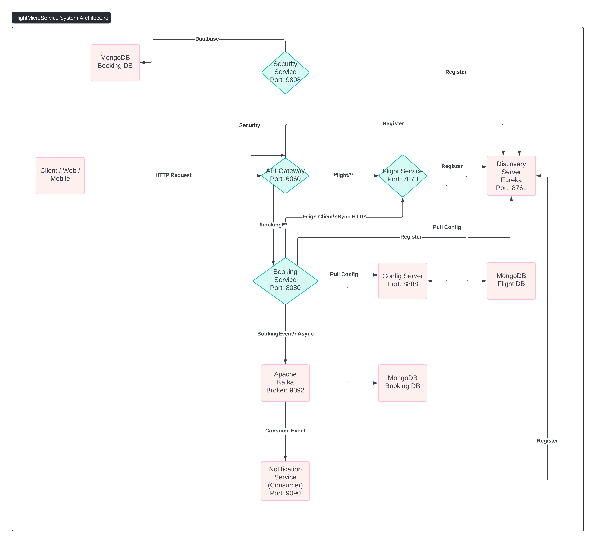
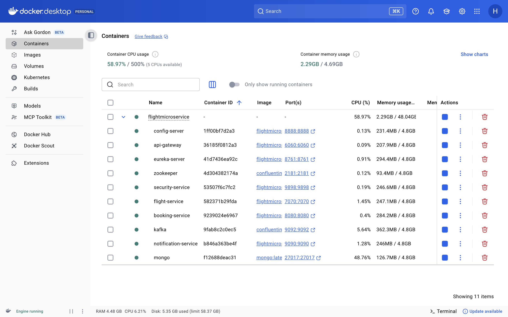
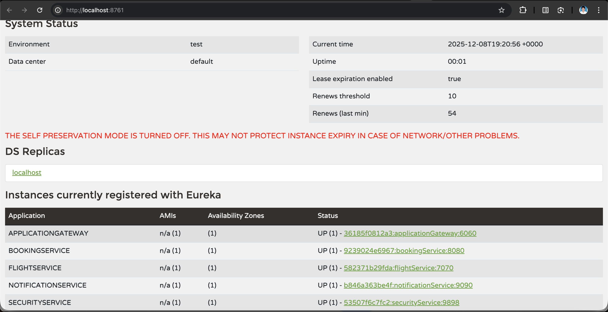
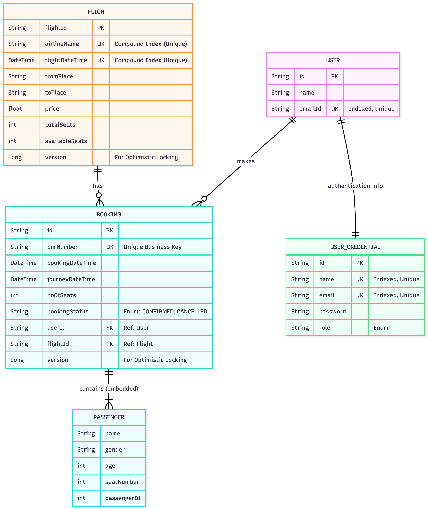
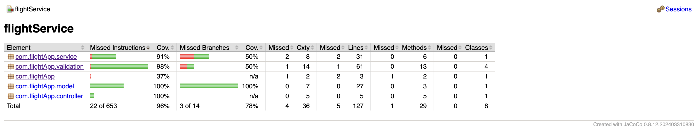
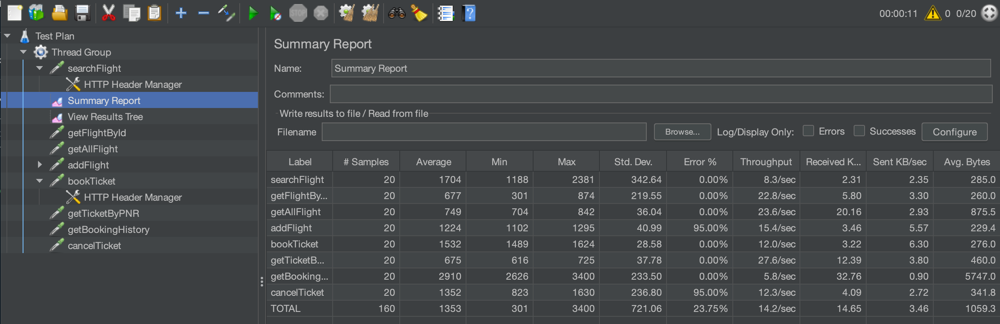
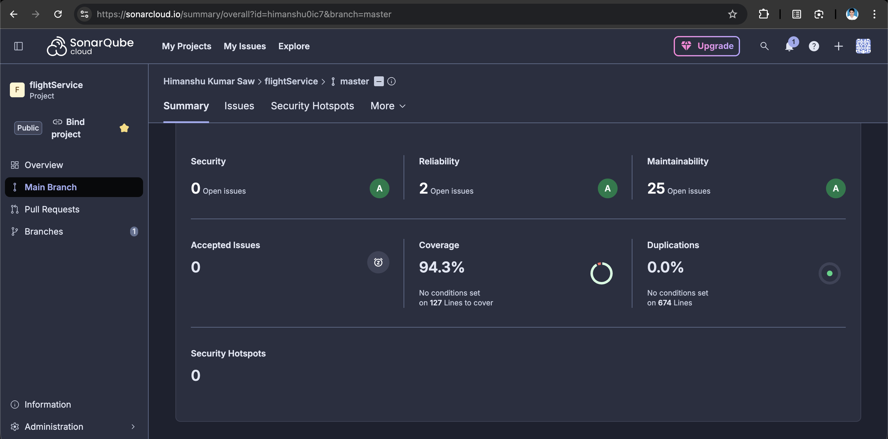

# Cloud-Native Flight Booking System


**This** is a robust, scalable, and high-performance microservices application designed for flight searching and booking. It demonstrates modern enterprise architecture patterns including **Reactive Programming**, **Event-Driven Architecture (Kafka)**, **Service Discovery**,**Gateway Security (JWT)** and **Centralized Configuration**.

---

## System Architecture

The system is built on the **API Gateway pattern**, ensuring a single entry point for all client requests while handling routing, load balancing, and security behind the scenes.




### Microservices Breakdown

| Service | Port | Technology | Description |
|---------|------|------------|-------------|
| **API Gateway** | `6060` | Spring Cloud Gateway | Central entry point with JWT security filtering & intelligent routing |
| **Discovery Server** | `8761` | Spring Cloud Eureka | Service registry for dynamic discovery and load balancing |
| **Config Server** | `8888` | Spring Cloud Config | Centralized configuration management for all microservices |
| **Security Service** | `9898` | Spring Security + JWT | User registration, authentication, and token generation |
| **Flight Service** | `7070` | Spring WebFlux + MongoDB | **Reactive** non-blocking flight inventory and search |
| **Booking Service** | `8080` | Spring MVC + OpenFeign | Ticket booking with inter-service communication |
| **Notification Service** | `9090` | Spring Kafka | Event-driven email/SMS notifications via Kafka consumers |

## Docker & Containerization



The entire system is containerized for seamless deployment across any environment.

### Docker Configuration

Each microservice uses a lightweight Dockerfile optimized for production deployment:
```dockerfile
FROM amazoncorretto:17
WORKDIR /app
COPY target/*.jar app.jar
ENTRYPOINT ["java", "-jar", "app.jar"]
```

## Service Discovery (Eureka)

All microservices automatically register with the Eureka Server upon startup, allowing them to communicate via service names (e.g., `lb://FLIGHT-SERVICE`) rather than hardcoded IPs.



---

## Data Model (ER Diagram)

The application maintains a strict separation of concerns. The **Flight Service** manages inventory and schedules, while the **Booking Service** creates a logical link via `flightId` and manages passenger PNRs.



* **Concurrency Control:** The Flight entity uses `@Version` for **Optimistic Locking** to prevent double-booking the last seat.
* **Data Integrity:** Unique Compound Indexes (`Airline` + `Time`) prevent duplicate flight entries.

---

## Quality Assurance & Testing

We adhere to strict quality gates with **>90% Code Coverage** and rigorous performance testing.

### 1. Code Coverage (JaCoCo & SonarCloud)
We use **JaCoCo** for local coverage analysis and **SonarCloud** for continuous code quality inspection.
* **Flight Service Coverage:** **96%**
* **Validation:** Strict DTO validation and Exception Handling paths are fully covered.



### 2. Performance & Load Testing (JMeter)
The system was stress-tested using **Apache JMeter** to evaluate stability under varying loads. We performed specific load tests with **20, 50, and 100 concurrent threads**.

* **Test Artifacts:** The test scripts (`.jmx`) and detailed CSV result files for each scenario (20, 50, 100 threads) are available in the [`Jmeter`](./Jmeter) folder.
* **Result:** The Reactive Flight Service maintained consistent throughput and low latency across all load tiers.



### 3. SonarQube Report
We use SonarCloud for continuous code quality inspection, ensuring zero bugs and vulnerabilities.

* **Project Status:** Passed (Grade A)
* **[View Live Report on SonarCloud](https://sonarcloud.io/summary/overall?id=himanshu0ic7&branch=master)**


### 4. SMS Prof


### 5. Endpoint Verification
> **Note:** A detailed document containing screenshots of all API endpoints (Positive & Negative Test Cases) is attached in the repository documentation folder.


---


## Key Features & Integrations

### Reactive Programming (WebFlux)
The **Flight Service** is built on Project Reactor. It uses `Mono` and `Flux` return types to handle high-volume search traffic without blocking threads, making it far more efficient than traditional blocking servlets.

### Apache Kafka Integration
The system uses an **Event-Driven** approach for notifications to decouple the booking process from email sending.
1.  User books a ticket -> **Booking Service** saves to DB.
2.  Booking Service publishes a `BookingEvent` to the `notification-topic`.
3.  **Notification Service** consumes the message and triggers an email/SMS.

### OpenFeign Client
The **Booking Service** communicates synchronously with the **Flight Service** (to check seat availability and fetch flight details) using **Spring Cloud OpenFeign**, providing a declarative REST client interface.

---

### Concurrency Control

- **Optimistic Locking:** Flight entity uses `@Version` to prevent double-booking
- **Unique Indexes:** Compound index on (Airline + Departure Time) prevents duplicates
- **Transactional Consistency:** Booking and seat reduction happen atomically

---

## Quality Assurance

We maintain enterprise-grade quality standards:

| Metric | Target | Actual | Status |
|--------|--------|--------|--------|
| Code Coverage | >90% | **96%** | Achieved |
| Performance (100 threads) | <200ms | ~150ms | Passed |
| SonarCloud Quality Gate | A | **A** | Passed |
| Zero Bugs | Required | **0 Bugs** | Clean |

### Testing Strategy

- **Unit Tests:** JUnit 5 + Mockito for service layer
- **Integration Tests:** TestContainers for MongoDB & Kafka
- **Performance Tests:** Apache JMeter (20/50/100 concurrent users)
- **Code Quality:** SonarCloud continuous inspection

---

## Getting Started

### Prerequisites

- **Docker Desktop** (required)
- **Java 17+** (optional, for local development)
- **Git** (to clone the repository)

### Deployment Options

Choose between two deployment methods based on your needs:

#### Option 1: Docker Deployment (Recommended for Production)

Complete containerized deployment with one command:
```bash
# Clone the repository
git clone https://github.com/himanshu0ic7/FlightAppDeployed.git
cd FlightAppDeployed

# Build and start all services
docker-compose up -d --build

# To rebuild and start specific service again
docker compose up -d --build <service-name>
```

#### Option 2: Local Development Setup

For active development with hot-reload capabilities:
```bash
# Clone the repository
git clone https://github.com/himanshu0ic7/FlightAppDeployed.git
cd FlightAppDeployed

# Make the startup script executable
chmod +x start-local.sh

# Start all services
./start-local.sh
```

**What the script does:**
1. Starts Kafka & Zookeeper containers via Docker Compose
2. Launches Config Server (waits 8s for initialization)
3. Starts Eureka Server (waits 10s for registration)
4. Sequentially starts all microservices with appropriate wait times
5. Each service runs with Maven Spring Boot plugin for hot-reload

**Prerequisites for local setup:**
- Ensure `.env` file exists in the project root with required environment variables
- MongoDB should be running locally or update connection strings in `application.yml`
- Ports 8761, 8888, 6060, 9898, 7070, 8080, 9090 must be available

### Verify Deployment

Wait ~60 seconds for all services to initialize, then check:

-  **Eureka Dashboard:** http://localhost:8761
-  **API Gateway:** http://localhost:6060
-  **MongoDB:** localhost:27017
-  **Kafka:** localhost:9092

All services should appear as "UP" in the Eureka dashboard.

---

## All API Endpoints

### Security Service

| Route | Method | Access | Description |
| :--- | :--- | :--- | :--- |
| /api/auth/register | POST | Public | Register a new user account. |
| /api/auth/login | POST | Public | Login with credentials to get JWT Access Token. |
| /api/auth/change-password |	PUT |	User |	Change password. | 
| /api/auth/update-profile	| PUT |	User |	Update profile details.|

### Flight Service

| Route | Method | Access | Description |
| :--- | :--- | :--- | :--- |
| /flight/api/flight/getAllAirlines | GET | Public | Retrieve all available airlines. |
| /flight/api/flight/getAllFlights | GET | Public | Retrieve all available flights. |
| /flight/api/flight/search | POST | Public | Search flights by source, destination, and date. |
| /flight/api/flight/addAirline | POST | Admin | Add a new airline to the system. |
| /flight/api/flight/airline/inventory/add | POST | Admin | Add new flight inventory (Blocked by Gateway for Users). |

### Booking Service

| Route | Method | Access | Description |
| :--- | :--- | :--- | :--- |
| /booking/api/booking/{flightId} | POST | User + Admin | Book a ticket for a specific flight (Requires JWT). |
| /booking/api/booking/ticket/{pnr} | GET | User + Admin | Retrieve a specific ticket by PNR. |
| /booking/api/booking/history/{email} | GET | User + Admin | Get booking history for a specific user. |
| /booking/api/booking/cancel/{pnr} | DELETE | User + Admin | Cancel a booking and trigger refund logic. |
